  

 

  

━━━━━━━━━━━━━━━━━━━━━━━━━━━━━━━━━━━━━━━━━━━━━━━━━━━━━━━━━━━━━━━━━━━━

## About

I work across the full data lifecycle — from cleaning and analyzing data, to building BI dashboards that drive decisions, to designing the data pipelines and AI systems that make those decisions automatic.

Currently focused on closing the gap between analysis and engineering.

**Now:** finishing Data Engineering coursework — dbt, Airflow, and data warehousing.

━━━━━━━━━━━━━━━━━━━━━━━━━━━━━━━━━━━━━━━━━━━━━━━━━━━━━━━━━━━━━━━━━━━━

## Current Focus

- Building end-to-end data analytics projects with real-world datasets
- Strengthening SQL and Python for production-level analysis
- Studying data engineering fundamentals: dbt, Airflow, and data warehousing
- Documenting every project the way I'd want it reviewed in production
- Exploring how generative AI applies to data workflows

━━━━━━━━━━━━━━━━━━━━━━━━━━━━━━━━━━━━━━━━━━━━━━━━━━━━━━━━━━━━━━━━━━━━

## Tech Stack

**Data Analysis**

**Business Intelligence**

**Data Engineering**

**Machine Learning & Deep Learning**

**Supporting Skills**

━━━━━━━━━━━━━━━━━━━━━━━━━━━━━━━━━━━━━━━━━━━━━━━━━━━━━━━━━━━━━━━━━━━━

## Featured Projects

| Project | Stack | What it does |
|---|---|---|
| [project-name-1](https://github.com/hodaelkassas/project-name-1) | SQL, Python | One-line description of the business problem it solves |
| [project-name-2](https://github.com/hodaelkassas/project-name-2) | Power BI | One-line description of the dashboard's decision impact |
| [project-name-3](https://github.com/hodaelkassas/project-name-3) | dbt, Airflow | One-line description of the pipeline it automates |

*(Replace with your actual repositories once published — three to four maximum.)*

━━━━━━━━━━━━━━━━━━━━━━━━━━━━━━━━━━━━━━━━━━━━━━━━━━━━━━━━━━━━━━━━━━━━

## Learning Journey

```mermaid
flowchart LR
    A[Data Analytics] --> B[Business Intelligence]
    B --> C[Advanced Analytics]
    C --> D[Data Engineering]
    D --> E[Machine Learning]
    E --> F[Deep Learning & Computer Vision]
    F --> G[Generative & Multimodal AI]

    style A fill:#F8FAFA,stroke:#6B7280,color:#111111
    style B fill:#F8FAFA,stroke:#6B7280,color:#111111
    style C fill:#F8FAFA,stroke:#6B7280,color:#111111
    style D fill:#105F68,stroke:#105F68,color:#ffffff
    style E fill:#F8FAFA,stroke:#6B7280,color:#111111
    style F fill:#F8FAFA,stroke:#6B7280,color:#111111
    style G fill:#F8FAFA,stroke:#6B7280,color:#111111
```

*(Highlighted stage = Data Engineering, where I am right now. Software, Cloud, and DevOps run alongside as supporting skills, not as a separate destination.)*

━━━━━━━━━━━━━━━━━━━━━━━━━━━━━━━━━━━━━━━━━━━━━━━━━━━━━━━━━━━━━━━━━━━━

## GitHub Analytics

  
  

━━━━━━━━━━━━━━━━━━━━━━━━━━━━━━━━━━━━━━━━━━━━━━━━━━━━━━━━━━━━━━━━━━━━

## Activity

  

━━━━━━━━━━━━━━━━━━━━━━━━━━━━━━━━━━━━━━━━━━━━━━━━━━━━━━━━━━━━━━━━━━━━

## Connect

