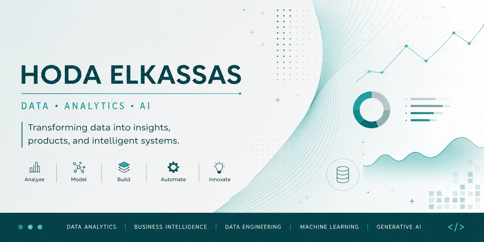

```mermaid
flowchart LR
    A[Data Analytics] --> B[Business Intelligence]
    B --> C[Advanced Analytics]
    C --> D[Data Engineering]
    D --> E[Machine Learning]
    E --> F[Deep Learning & Computer Vision]
    F --> G[Generative & Multimodal AI]

    style A fill:#F8FAFA,stroke:#6B7280,color:#111111
    style B fill:#F8FAFA,stroke:#6B7280,color:#111111
    style C fill:#F8FAFA,stroke:#6B7280,color:#111111
    style D fill:#105F68,stroke:#105F68,color:#ffffff
    style E fill:#F8FAFA,stroke:#6B7280,color:#111111
    style F fill:#F8FAFA,stroke:#6B7280,color:#111111
    style G fill:#F8FAFA,stroke:#6B7280,color:#111111
```
 

 

 

  

> *Every project is a lesson. Every dataset tells a story. Welcome to my journey.*

I'm building my career around data — learning, experimenting, and creating solutions that turn information into meaningful insights.

This GitHub is more than a collection of repositories. It's a living record of my journey, where I share projects, document what I learn, and continuously improve — one step, one project, and one lesson at a time.

I work across the full data lifecycle — from cleaning and analyzing data, to building BI dashboards that drive decisions, to designing the data pipelines and AI systems that make those decisions automatic.

Currently focused on closing the gap between analysis and engineering.

>  **Now:** finishing Data Engineering coursework — dbt, Airflow, and data warehousing.

 

  

-  Building end-to-end data analytics projects with real-world datasets
-  Strengthening SQL and Python for production-level analysis
-  Studying data engineering fundamentals: dbt, Airflow, and data warehousing
-  Documenting every project the way I'd want it reviewed in production
-  Exploring how generative AI applies to data workflows

 

  

**Data Analysis**

**Business Intelligence**

**Data Engineering**

**Machine Learning & Deep Learning**

**Supporting Skills**

 

  

| Project | Stack | What it does |
|---|---|---|
| [manufacturing-downtime](https://github.com/hoda-elkassas/manufacturing-downtime) | Jupyter, Python | Analyzes manufacturing downtime data to surface root causes and reduce lost production time |
| [acadexa](https://github.com/hoda-elkassas/acadexa) | Python | Academic advising tool for credit-hour systems |
| [acadexa_platform](https://github.com/hoda-elkassas/acadexa_platform) | Dart | AI-powered Smart Academic Advisor — GPA analysis, course tracking, and expert recommendations |

*(Update descriptions/stack as each project evolves — three to four maximum keeps this section scannable.)*

 

  

*(Highlighted stage = Data Engineering, where I am right now. Cloud and DevOps run alongside as supporting skills, not as a separate destination.)*

 

  

  
  

  

  

 

  

  

> ⚠️ The snake graphic above only renders once the GitHub Action workflow (`snake.yml`) is added to the `hoda-elkassas/hoda-elkassas` profile repo and has run at least once — see the setup note included alongside this file.

 

  

